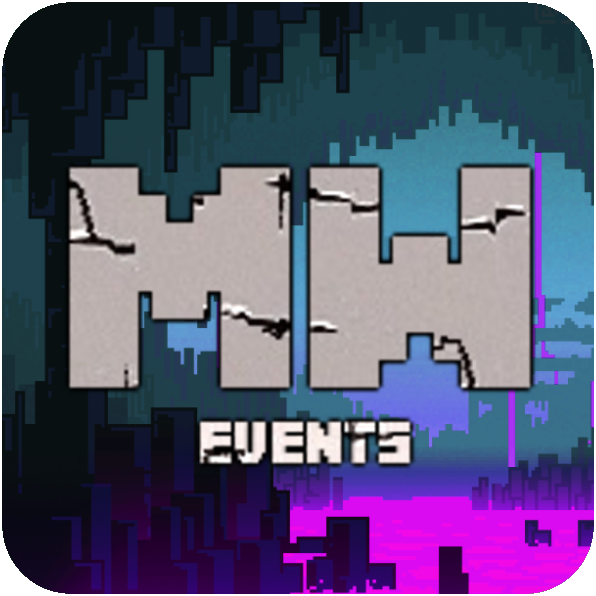

  

# MW Bot

## About
MW Bot is by udu3324. The bot attaches onto minecraft by reading its latest.log lines and parsing it. It parses the lines
into things like events happening on the server, votes, sharpening alerts, and more.

## Documentation
Direct message `_._#3324` on discord to get started on how to get MW Bot set up. (its complicated)

## Contribution
You could contribute to MW Bot by reporting 
[issues](https://github.com/udu3324/MW-Bot/issues/new/choose), creating
[pull requests](https://github.com/udu3324/MW-Bot/compare), and sending me donations to my 
[PayPal](https://www.paypal.com/cgi-bin/webscr?cmd=_donations&business=6R3DMFCTT9KA2&item_name=Donations%20will%20be%20appreciated%20and%20will%20help%20me%20:%29&currency_code=USD&source=url).
